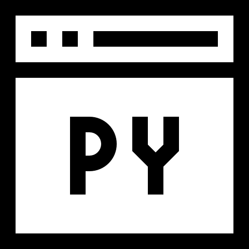

# EN PROGRESO...

Text can be **bold**, _italic_, or ~~strikethrough~~.

[Link to another page](./another-page.html).

There should be whitespace between paragraphs casi 

There should be whitespace between paragraphs. We recommend including a README, or a file with information about your project.

# EDUCACION

**2021 - Magister en ciencias de la ing. electrónica**  
_Universidad Técnica Federico Santa María - Valparaíso, Chile_

**2021 - Ingeniería civil electrónica**  
_Universidad Técnica Federico Santa María - Valparaíso, Chile_

# EXPERIENCIA

**Junio 2021 - Actualidad. Kauel**  
_Ingeniero en desarrollo - Área de inteligencia artificial y Ciencia de datos._

**Proyectos Destacados**

- _Cálculo automático de volumen de paquetes, cajas y pallets._
- _Detección y conteo de cajas y etiquetas en un pallet._

- Tecnologías usadas:
    -  Python.
    -  API-Rest.
    -  Visión Artificial.
    -  Base de datos.
    -  Ciencia de datos.
    -  Control de versiones.

**Enero 2021 - Marzo 2021. AC3E**  
_Apoyo técnico y de desarrollo_

**Proyectos Destacados**

- _Envío y recepción de datos a través de una red inalámbrica._

- Tecnologías usadas:
    -  Python.
    -  Analizador de protocolos.
    -  Base de datos.
    -  Control de versiones.

# PUBLICACIONES

[2019 - Parameter Estimation over Wired Networks with Time-Delay and Packet Collision - IEEE CHILEAN Conference on Electrical, Electronics Engineering, Information and Communication Technologies (CHILECON)](https://ieeexplore.ieee.org/abstract/document/8987445).

# CERTIFICACIONES

[AI for Medicine - DeepLearning.AI](https://coursera.org/verify/specialization/M82JU5EPPYZA).
](https://ieeexplore.ieee.org/abstract/document/8987445).

[HCIA Artificial Intelligence - Huawei](https://support.huawei.com/learning/verifycertificate).
